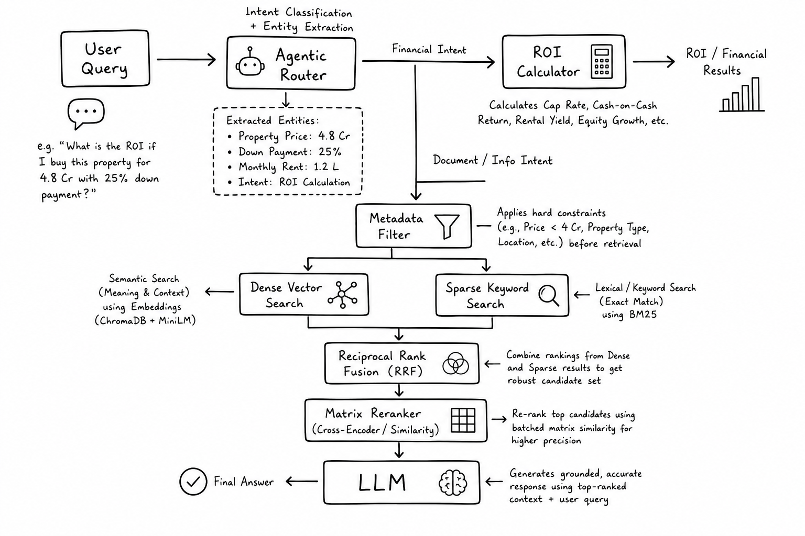

# Hybrid RAG Assistant


This project is a production-grade, full-stack AI assistant designed specifically for real estate analysis. It moves beyond standard LangChain tutorials by implementing a highly robust **Hybrid RAG (Retrieval-Augmented Generation)** pipeline, an **Agentic Router**, and dynamic **Financial Pro-Forma Calculators**. 

Built with Streamlit, Groq, and LangChain, this assistant processes complex property disclosures, zoning laws, and financial data to deliver bank-grade ROI calculations and expert-level property summaries.

---

## 🌐 Live Demo

Try the deployed application here:

Demo: https://hybrid-rag-assistant-dxrpvnpurkiwixnbsntq3c.streamlit.app/

No setup required — simply upload documents and start querying.

---

## 📄 Sample Documents for Testing

To quickly test the assistant, you can use the sample property documents included in the repository:

- test_data/Whitefield_Tech_Park_ROI.pdf
- test_data/Malabar_Heritage_Annex_Legal.pdf

These documents are specifically designed to demonstrate:

### Whitefield Property
- ROI calculations
- Rental yield analysis
- Cash-on-cash return calculations
- Investment-focused queries

### Malabar Property
- Heritage restrictions
- Zoning regulations
- Legal compliance analysis
- Municipal case references

You may also upload your own real estate PDFs, disclosures, legal documents, contracts, or property reports to analyze them using the Hybrid RAG pipeline.

---

## 🚀 Quick Start

1. Open the live demo.
2. Upload either:
   - One of the sample PDFs from the test_data folder, or
   - Your own property documents.
3. Ask questions about:
   - ROI and investment analysis
   - Legal restrictions
   - Zoning regulations
   - Property comparisons
   - Rental projections
4. Receive grounded answers generated from the uploaded documents.

---

## ✨ Key Features

* **Multi-Format Ingestion:** Seamlessly parse and chunk live property URLs and complex PDF contracts/disclosures.
* **Bank-Grade ROI Calculator:** Calculates true cash-on-cash returns, cap rates, and 5-year equity amortization (handling Indian numeric formats like Crores and Lakhs natively).
* **Progressive UI:** Clean, glassmorphism-styled Streamlit interface that hides complex financial assumptions (vacancy rates, maintenance) until the user needs them.
* **Multi-Persona Analysis:** Swap between "Investor", "Homebuyer", and "Legal Expert" to dynamically alter the AI's analytical lens and retrieval prioritization.

---

## 🧠 Architecture Pipeline: The Hybrid Engine

The system utilizes a state-of-the-art multi-channel retrieval and routing architecture to eliminate hallucinations, handle exact numeric filtering, and bridge semantic gaps.

### 1. The Agentic Router & Entity Extraction
Standard RAG pipelines fail when users ask for mathematical operations or hard constraints. This system uses a fast, structured LLM (`llama-3.3-70b-versatile`) as a gatekeeper.
* **Intent Classification:** Dynamically routes the user to the Python ROI calculator or the Vector RAG pipeline.
* **Numeric Parsing:** Extracts and converts complex phrasing (e.g., "25% down", "1.5 cr", "1.2 L") into exact floats for backend calculations, preventing intent confusion.

### 2. Metadata Pre-Filtering (Hard Constraints)
Vector databases cannot process logic like "Less than 4 Crore." 
* The router extracts maximum price limits or property types and passes them as a `$lt` hard filter to ChromaDB. 
* This physically blocks over-budget properties from the vector search *before* semantic similarity is calculated, ensuring 100% accuracy on financial constraints.

### 3. Multi-Channel Hybrid Retrieval
To guarantee no clause or ID number is missed, the assistant queries two distinct databases simultaneously:
* **Semantic Channel (Dense):** Uses `sentence-transformers/all-MiniLM-L6-v2` via ChromaDB to understand conceptual questions (e.g., "Can I knock down the house?" matching with "demolition" or "heritage restrictions").
* **Lexical Channel (Sparse):** A custom, pure-Python **Okapi BM25** engine strips punctuation and tokenizes text to find exact alphanumeric matches (e.g., Zoning Codes, Case ID numbers) that dense vectors typically ignore.

### 4. Reciprocal Rank Fusion (RRF) & Lexical Injection
* **Lexical Injection:** Document filenames are injected directly into chunk texts to bridge vocabulary gaps (e.g., matching a user's prompt about a "Tech Park" to a document containing the words "IT Corridor").
* **RRF Blending:** The results from the Dense and Sparse channels are mathematically fused using Reciprocal Rank Fusion, prioritizing documents that rank highly across both methodologies.

### 5. Batched Matrix Cross-Reranking
Before sending the final context to the LLM, the top 15 fused documents undergo a highly optimized NumPy matrix operation. This batched dot-product calculation reranks the documents via exact cosine similarity in milliseconds, passing only the top 5 highest-fidelity chunks to the generative model.

---

## 🚀 Installation & Setup

1. **Clone the repository:**
```bash
git clone https://github.com/yourusername/hybrid-rag-assistant.git
cd hybrid-rag-assistant

```


2. **Install dependencies:**
```bash
pip install -r requirements.txt

```

3. **Set your API Keys:**
Add your Groq API key to `.streamlit/secrets.toml`:
```toml
GROQ_API_KEY = "your_api_key_here"

```

4. **Run the application:**
```bash
streamlit run app.py

```

---

## 🧪 Example Queries to Try

Once you have uploaded property documents, try these specific queries to see the hybrid architecture in action:

* **Testing the ROI Calculator & Extraction:**
> *"I want to buy the Whitefield property for 4.8 crore with a 1.2 lakh rent. What is my ROI if I put exactly 25% down?"*


* **Testing Metadata Pre-Filtering:**
> *"Show me all properties available for under 4 Crore."*
> *(The agent will recognize this hard limit and refuse to show properties over 4 Cr, even if they are a semantic match).*


* **Testing Lexical Exact Matching (BM25):**
> *"What is the specific municipal variance order for the Malabar plot, and what is the exact case reference number pending in court?"*


* **Testing Complex Semantic Reasoning:**
> *"I want to buy the Malabar plot, knock down the old house, and build a 4-story restaurant in the back. Can I do this?"*
> *(The agent will cross-reference heritage laws, coastal zoning, and height limits to give a definitive answer).*


---

## 👨‍💻 Author

**Ch Sai Kaushik**

B.Tech CSE (Data Science), VIT Vellore

- AI & Machine Learning Enthusiast
- LLM Engineering & RAG Systems
- Spring Boot Backend Developer
- Data Science Student
